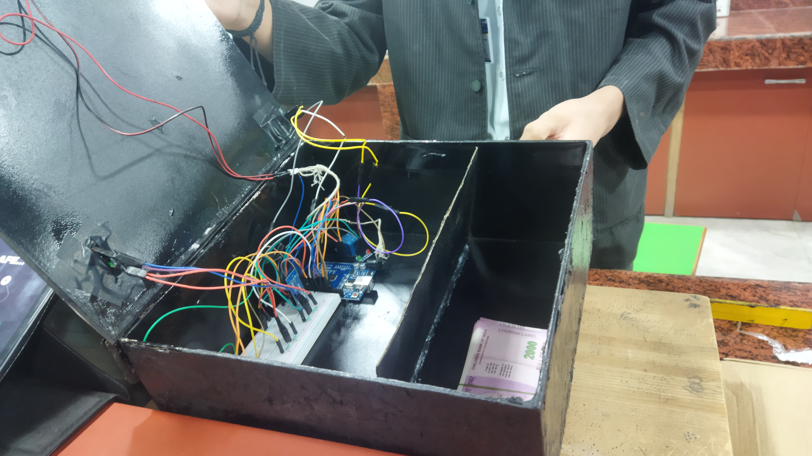
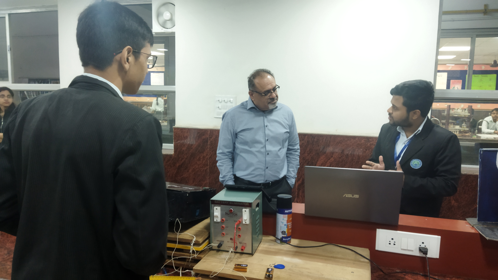
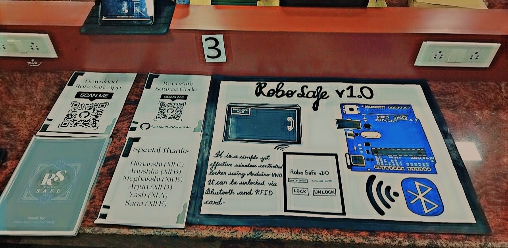
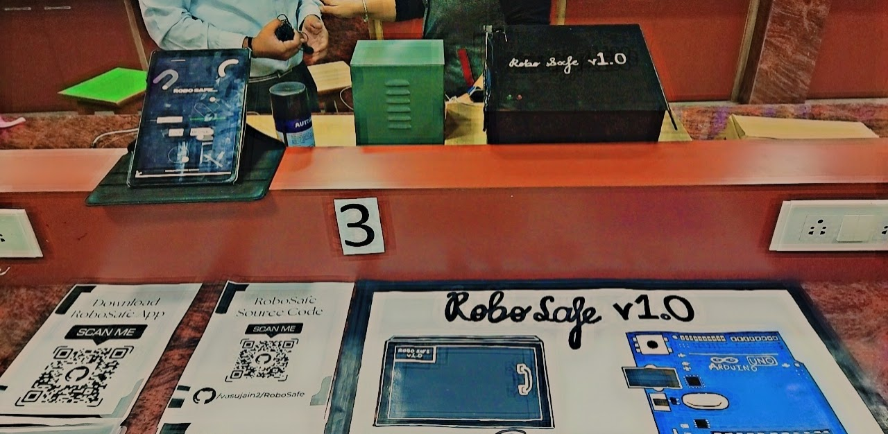
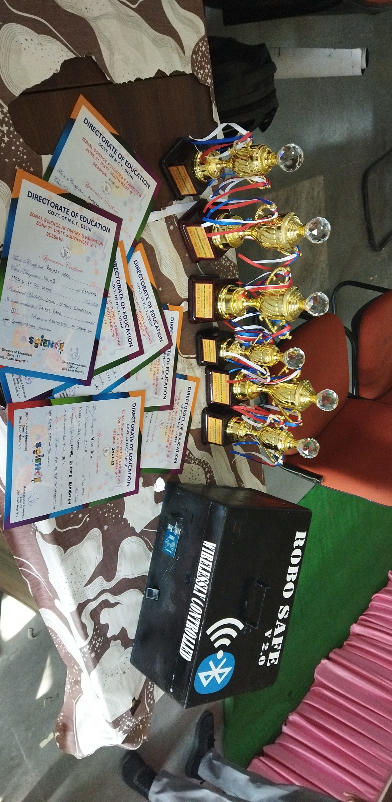

# RoboSafe - Wireless Controlled Locker with Arduino Mega

RoboSafe is a simple yet effective wireless controlled locker using an Arduino Mega. It can be unlocked via the mobile app, RFID card, fingerprint, and even stream live footage to your device. This project was originally created as part of the National Science Exhibition of India 2022.

## Features

- Wireless control of the locker.
- Unlocking options: Mobile app, RFID card, and fingerprint.
- Live video streaming capability.
- Created for the National Science Exhibition of India 2022.

## Project Versions

- **Version 1:** The initial version was created for our internal school round. You can access the code for this version on our `v-1` branch.

- **Version 2 (Current):** The current and final version of the project, which includes enhancements and improvements.

## Project Media

Here are some images of the final project:

And here are some demonstration videos of the project:

- [Watch Video 1](https://youtube.com/shorts/sdpYSFQem0w)
- [Watch Video 2](https://youtube.com/shorts/omGN13xZLuQ)

## Materials Required

To build the RoboSafe project, you'll need the following materials:

- Arduino Mega (or compatible)
- HC-05 Bluetooth Module
- RC522 RFID Reader
- Copper Hooker Wires
- Solenoid Lock 12v
- R307 Fingerprint Sensor
- NodeMCU ESP-32 Cam Module

## Connections

Here are the connections for various components used in the project:

### RFID Reader:

- VCC - Pin 3.3v
- GND - GND
- Reset (RST) - Pin D49
- SDA(SS) - Pin D53
- MOSI - Pin D51
- MISO - Pin D50
- SCK - Pin D52

### Bluetooth Module:

- VCC - 5v
- GND - GND
- TX - D2 (RX)
- RX - D3 (TX)

### Relay:

- Relay (NO) - Lock (+ve)
- Relay (COM) - Adaptor +ve
- Lock (-ve) - Adaptor -ve
- IN - D7
- GND - GND
- VCC - 5v

### OLED Display:

- SCL - A21
- SDA - A20
- VCC - 5v
- GND - GND

### Others:

- Green Light - D35
- Red Light - D37
- Buzzer - D6
